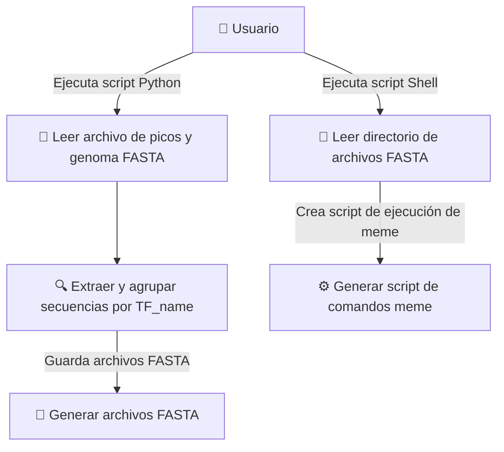

# Proyecto de Automatización para la Identificación de Sitios de Unión de Factores de Transcripción en E. coli en experimentos de ChIP-Seq

Fecha: [dd/mm/2025]

Participantes: 

- Andromeda Coral Gutierrez , email: andcoral@lcg.unam.mx 

## Descripción del Problema
<!-- Puedes empezar con una introducción, luego la justificación y plantear el problema. -->

El proyecto busca automatizar la extracción y el análisis de secuencias genómicas donde los factores de transcripción se unen en _Escherichia coli_. Se cuenta con un archivo que contiene información sobre los picos de unión, y con otro archivo que posee la secuencia completa del genoma. El objetivo es generar archivos FASTA específicos para cada factor de transcripción (TF), agrupando las secuencias de los picos de unión correspondientes. Posteriormente, estas secuencias serán analizadas mediante el software `meme` para identificar motivos, para eso se tiene que generar un script shell con todas las instrucciones `meme` usando las secuencias fasta de los picos de cada TF.

## Especificación de Requisitos


### Requisitos Funcionales:

#### A. Extracción de Secuencias FASTA:
    
1.  **Entrada de Datos:**
    
    -   El módulo debe aceptar como argumentos de línea de comandos los siguientes archivos:
        -   Archivo de picos que contiene la información de las regiones de unión de cada factor de transcripción (ver sección "Archivo de Picos" al final de la sección de requisitos).
        -   Archivo de la secuencia del genoma de _E. coli_ en formato FASTA.
    -   Añadir un argumento para especificar el directorio de salida donde se almacenarán los archivos generados.
2.  **Extracción y Procesamiento de Secuencias:**
    
    -   Leer el archivo de picos para obtener las posiciones de inicio y fin de los picos asociados a cada `TF_name`. Sin olvidar verificar que las coordenadas de dichas posiciones estén dentro del rango del genoma dado.
    -   Extraer las secuencias desde el archivo FASTA del genoma utilizando las coordenadas `Peak_start` y `Peak_end`, asegurándose de considerar solamente la cadena forward.
3.  **Generación de Archivos FASTA:**
    
    -   Crear archivos FASTA individuales para cada `TF_name`. Los nombres de los archivos deben coincidir con el `TF_name` y usar la extensión `.fa`.
    -   Almacenar estos archivos en el directorio de salida especificado.
    


#### B. *Automatización del Análisis de Motivos:**
    
     
1.  **Entrada de Directorio:**
    - Archivos con las secuencias de dna de los picos de cada TF.
    
2.  **Generación de Script de Automatización:**
    
    -   Iterar sobre cada archivo FASTA en el directorio proporcionado.
    -   Para cada archivo, debe generar una línea de comando para el software `meme`, ajustada para ejecutar el análisis de motivos con los parámetros predefinidos.
    
3.  **Salida del Script:**
    
    -   El módulo debe generar un script de shell que contiene todas las líneas de comandos necesarias para ejecutar `meme` en cada archivo FASTA.
    -   Este script debe grabarse en el directorio de trabajo actual con un nombre predefinido, como `run_meme.sh`.
    

### **Requisitos No Funcionales:**

-   **Portabilidad y Usabilidad:**
    
    -   Compatible con sistemas Unix/Linux.
    -   El sistema debe ser ejecutable desde la línea de comandos.
    -   Todos los datos de entrada a los programas deben pasarse via argumentos.
    -   Si se implementa código debe usarse python o scripts shell.
    
-   **Calidad y Mantenimiento:**
    
    -   Utilización de Git para el seguimiento y revisión del código.
    -   Documentación clara y comentarios efectivos deben acompañar todo el proyecto.
    -   Deben realizarse pruebas las pruebas necesarias para la validación correcta del software.


### C. Descripción de Datos de Entrada y Salida 

#### Formato del Archivo de Picos

Este archivo contiene información crucial sobre las regiones de unión de los 144 factores de transcripción (TFs) en _Escherichia coli_. Los datos están organizados en columnas que permiten identificar detalles específicos sobre la unión de los TFs a lo largo del genoma. El formato del archivo y la descripción de cada columna se detallan a continuación:

-   **Dataset_Ids:**
    
    -   _Descripción:_ Identificadores únicos para cada conjunto de datos. Estas IDs indican diferentes experimentos o condiciones bajo las cuales se determinaron los sitios de unión para los TFs.
    -   _Ejemplo:_ "DS001","DS002", etc.
-   **TF_name:**
    
    -   _Descripción:_ El nombre del factor de transcripción que se une al genoma en la región especificada.
    -   _Ejemplo:_ "AraC", "LacI", etc.
-   **Peak_start:**
    
    -   _Descripción:_ La posición inicial en el genoma donde comienza el pico de unión. Se refiere a la ubicación del primer nucleótido del pico.
    -   _Ejemplo:_ 345676, 123456, etc.
-   **Peak_end:**
    
    -   _Descripción:_ La posición final en el genoma donde termina el pico de unión. Se refiere a la ubicación del último nucleótido del pico.
    -   _Ejemplo:_ 345786, 123556, etc.
-   **Peak_center:**
    
    -   _Descripción:_ Posición central del pico de unión, calculada como el promedio o posición entre el `Peak_start` y `Peak_end`.
    -   _Ejemplo:_ 345731, 123501, etc.
-   **Peak_number:**
    
    -   _Descripción:_ Número secuencial utilizado para identificar picos dentro de un conjunto de datos. Esto es útil para referencias internas.
    -   _Ejemplo:_ 1, 2, 3, etc.
-   **Max_Fold_Enrichment:**
    
    -   _Descripción:_ Valor que representa el máximo enriquecimiento observado en el sitio de unión del pico.
    -   _Ejemplo:_ 15.4, 22.3, etc.
-   **Max_Norm_Fold_Enrichment:**
    
    -   _Descripción:_ Valor de máximo enriquecimiento normalizado, ajustado por un factor de control para comparaciones equitativas entre experimentos.
    -   _Ejemplo:_ 12.0, 20.1, etc.
-   **Proximal_genes:**
    
    -   _Descripción:_ Lista de genes cercanos al pico de unión, proporcionando contexto para el análisis funcional.
    -   _Ejemplo:_ "geneA, geneB", "geneX, geneY", etc.
-   **Center_position_type:**
    
    -   _Descripción:_ Denota la ubicación genómica del pico central, como intergénica, intrónica, etc.
    -   _Ejemplo:_ "intergénica", "intrónica", etc.


## Análisis y Diseño

<!-- Incluir el algoritmo o pseudocódigo. También puedes usar casos de uso, u otros diagramas UML. Como sugerencia dar solución requisito por requisito. Describir formatos de datos de entrada y salida. -->


#### Módulo 1: Extractor y Creador de Secuencias FASTA

**Objetivo:** Extraer las secuencias genómicas correspondientes a los picos de unión de los factores de transcripción y generar archivos FASTA individuales para cada `TF_name`.

**Flujo de Trabajo:**

1.  **Lectura de Entradas:**
    
    -   Cargar el archivo de picos y el archivo FASTA del genoma.
    -   Obtener el directorio de salida desde la línea de comandos.
2.  **Procesamiento de Datos:**
    
    -   Leer cada fila del archivo de picos.
    -   Extraer los campos `TF_name`, `Peak_start`, `Peak_end` para cada entrada.
    -   Para cada `TF_name`, usar las posiciones `Peak_start` y `Peak_end` para extraer la secuencia correspondiente del archivo FASTA del genoma.
3.  **Generación de FASTA:**
    
    -   Agrupar las secuencias extraídas por `TF_name`.
    -   Crear un archivo FASTA por cada `TF_name` en el directorio de salida con la misma estructura `<TF_name>.fa`.


**Algoritmo**

```
1. Inicio
2. Leer archivo de picos
3. Para cada registro:
   a. Obtener TF_name, Peak_start, Peak_end
   b. Extraer secuencia del genoma usando Peak_start y Peak_end
   c. Agrupar secuencias por TF_name
4. Por cada TF_name:
   a. Crear archivo FASTA
   b. Escribir secuencias en archivo
5. Fin
```

#### Módulo 2: Automatizador del Análisis con `meme`

**Objetivo:** Generar un script de shell que contenga todos los comandos necesarios para ejecutar `meme` en los archivos FASTA generados para cada factor de transcripción.

**Flujo de Trabajo:**

1.  **Lectura de Entradas:**
    
    - Directorio con archivos fasta.
    
2.  **Generación de Comandos:**
    
    -   Iterar sobre cada archivo `.fa` en el directorio.
    -   Generar una línea de comando para ejecutar `meme` usando cada archivo FASTA.
    -   Incluir opciones necesarias (por ejemplo, `-oc <output_directory>`, `-mod oops`, etc.) y asegurar nombrar el directorio de salida para cada ejecución de `meme`.
3.  **Salida del Script:**
    - salida a pantalla
    

**Algoritmo:**

```plaintext
1. Inicio
2. Leer todos los archivos FASTA en el directorio
3. Para cada archivo FASTA:
   a. Verificar que el archivo exista y no esté vacío.
   b. Formar comando: meme <archivo_fasta> -oc <nombre_directorio> ... 
   c. Imprimir comando
4. Redireccionar salida a un archivo script: run_meme.sh
5. Fin
```


### Diagrama de Caso de Uso (PlantUML) para Visualizar el Proceso:

Usar un editor para visualizar el diagrama <https://sujoyu.github.io/plantuml-previewer/>

```
@startuml
actor "Usuario" as usuario

rectangle "Sistema de Extracción y Creación de FASTA (Python)" {
    usecase "Leer archivo de picos y genoma FASTA" as UC1
    usecase "Extraer y agrupar secuencias por TF_name" as UC2
    usecase "Generar archivos FASTA" as UC3
}

rectangle "Script de Automatización de meme (Shell)" {
    usecase "Leer directorio de archivos FASTA" as UC4
    usecase "Generar script de comandos meme" as UC5
}

usuario --> UC1 : Ejecuta script Python
UC1 --> UC2
UC2 --> UC3 : Guarda archivos FASTA
usuario --> UC4 : Ejecuta script Shell
UC4 --> UC5 : Crea script de ejecución de meme

@enduml
```

En formato marmaid, que stackEdit sí reconoce.


